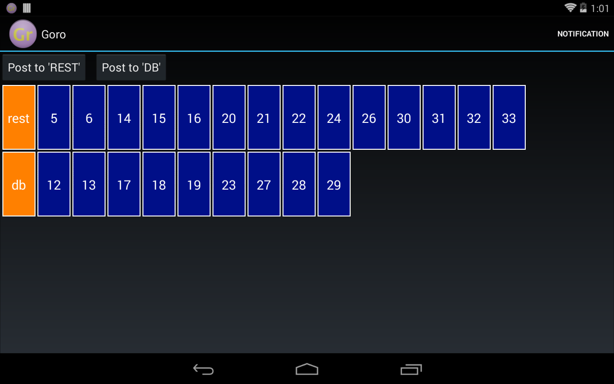

Goro Sample
-----------

Android activity that uses Goro via [binding](../README.md#Service) to a `GoroService`.
Activity contains two buttons for posting mock tasks (that make their thread sleep for a small
random period) to corresponding queues (REST and DB).
There is also a button that makes a notification with content intent that sends a task directly
to the service.

